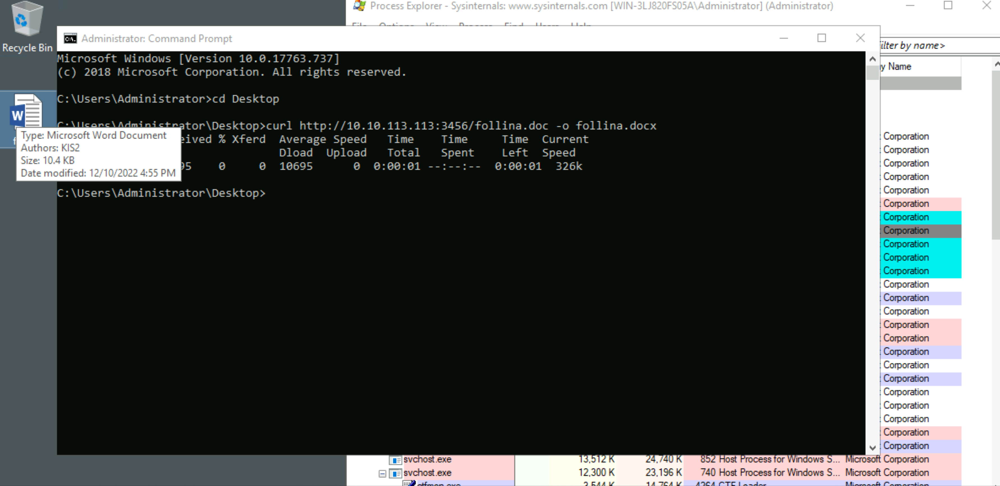
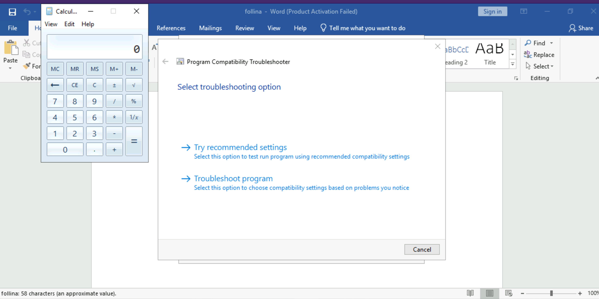
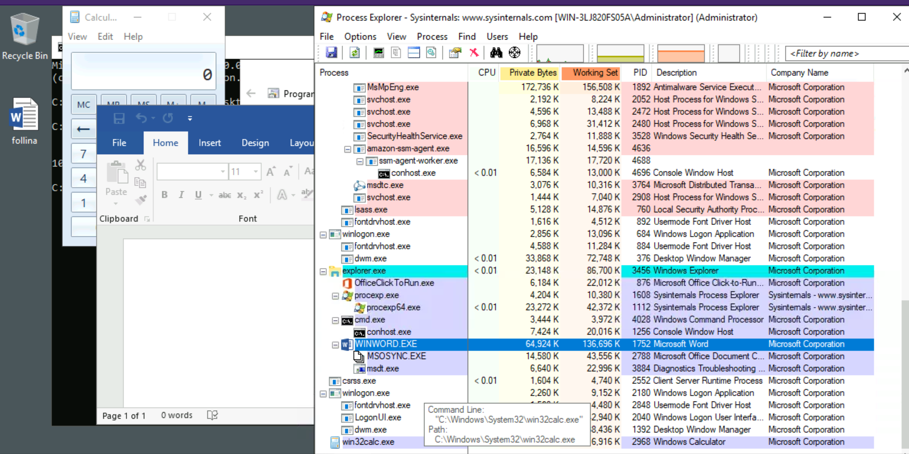
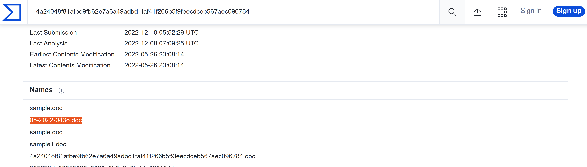
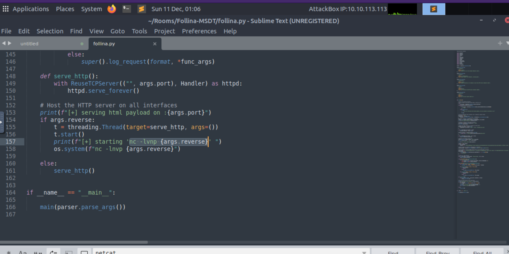
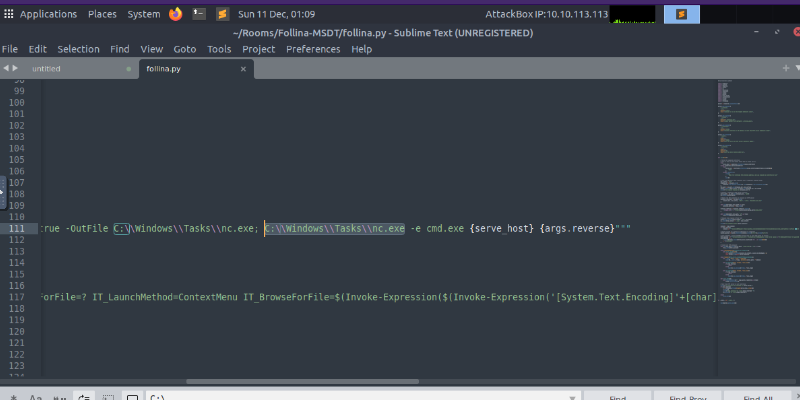

# Follina MSDT

The MSDT exploit is not really something new. A [bachelor’s thesis](https://benjamin-altpeter.de/doc/thesis-electron.pdf) 
was published August 2020 with techniques on how to use MSDT for code execution. 

Almost two years after that initial publication, pieces of evidence of MSDT exploitation 
as well as code execution via Office URIs has triggered several independent researchers to file separate reports to 
[MSRC](https://msrc-blog.microsoft.com/)

It’s not until the discovery of nao_sec, which was made public in twitter, that attacks using this particular vector 
is actively being made in the wild. This was picked up by Kevin Beaumont who publicly identified it as a zero-day 
that Microsoft [EDR products](blue-edr:index) are failing to detect, and then later classified by Microsoft as a 
zero-day with the vulnerability name [CVE-2022-30190](https://nvd.nist.gov/vuln/detail/cve-2022-30190).

## Exploitation

Two important aspects of this vulnerability are: 1) specific docx files contain OLE (originally abbreviates to Object Linking and Embedding) Object references, and sometimes, they take the form of HTML files hosted elsewhere, and 2) MS-MSDT allows for code execution.

Combining the above two aspects together, an MS-MSDT HTML scheme can be used to execute PowerShell code, and that a `docx` file can be used to load it via word’s external reference capability.

More specifically, drilling into the `docx` structure, the `word/_rels/document.xml.rels` file has an XML tag `<Relationship>` with an attribute `Type="http://schemas.openxmlformats.org/officeDocument/2006/relationships/oleObject"` that describes an external oleObject reference. In order to exploit this docx feature, we can edit the contents of this tag to point instead to the payload that we're hosting by changing the Target value into `http://<external_payload_server.com>/<payload.html>` and the `TargetMode` value into `External`.

In the `word/document.xml` file, there's an XML tag that starts with <code><o:OLEObject...></code> wherein we should change the `Type` value to `Link` and then add the `Key-Value` pair attribute `UpdateMode="OnCall"`.

John Hammond has created a [tool to automate the process of creating a malicious document (maldoc)](https://github.com/JohnHammond/msdt-follina) and host the malicious html file that houses the bad command.

| 
|:--:|
| Get the maldoc over to the vulnerable machine and click it. |

| 
|:--:|
| Winword and calc are opened. |

| 
|:--:|
| `win32calc.exe` executed upon opening of the maldoc. |

| 
|:--:|
| According to VirusTotal, the filename discovered in the wild is `05-2022-0438.doc`. |

| 
|:--:|
| The binary used to establish a reverse shell is `netcat`. |

| 
|:--:|
| It is downloaded to `C:\Windows\Tasks`. |

The child process of `winword.exe` is `msdt.exe`, and the other parent process, `sdiagnhost.exe` has a child process `conhost.exe`.

The most obvious piece of evidence to conclude that the "Zero Click" implementation of the exploit was used is `prevhost.exe`

## Detection

The Windows machine that we’ve used to study the exploitation of the vulnerability has been pre-configured to have logging enabled for:

* Audit Process Creation
* Command Line Process Auditing, and
* Script Block Logging

These auditing mechanisms are not configured by default and as such, it is imperative that these are turned on in your own environments to aid in the detection of suspicious behavior, and to help keep valuable data available for forensic examiners.

Use Event Log Viewer for Windows for [detecting Follina: Microsoft Office remote code execution zero-day ->](https://www.logpoint.com/en/blog/detecting-follina-microsoft-office-remote-code-execution-zero-day/)

## Remediation

[Guidance for CVE-2022-30190 Microsoft Support Diagnostic Tool Vulnerability – Microsoft Security Response Center ->](https://msrc-blog.microsoft.com/2022/05/30/guidance-for-cve-2022-30190-microsoft-support-diagnostic-tool-vulnerability/)

You'll need a new app to open this ms-msdt :)

## Further reading

* [Follina — a Microsoft Office code execution vulnerability | by Kevin Beaumont | May, 2022 | DoublePulsar](https://doublepulsar.com/follina-a-microsoft-office-code-execution-vulnerability-1a47fce5629e) - Full timeline, early details regarding the vulnerability, and “Follina” namesake courtesy of Kevin Beaumont
* [Rapid Response: Microsoft Office RCE - Follina MSDT Attack (huntress.com)](https://www.huntress.com/blog/microsoft-office-remote-code-execution-follina-msdt-bug)

